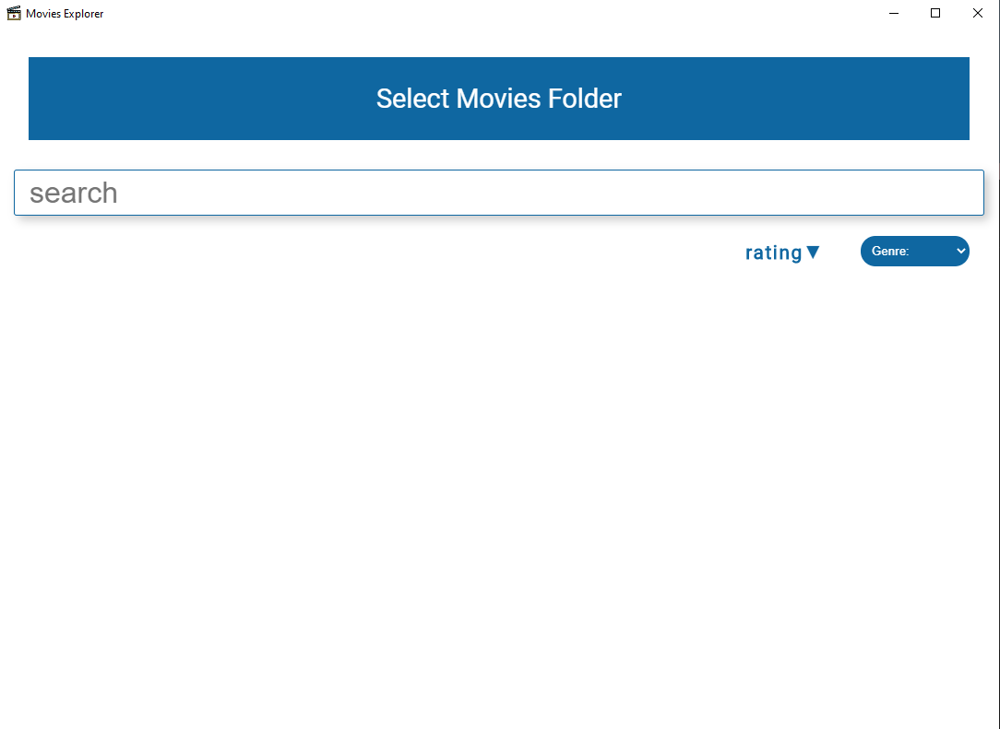
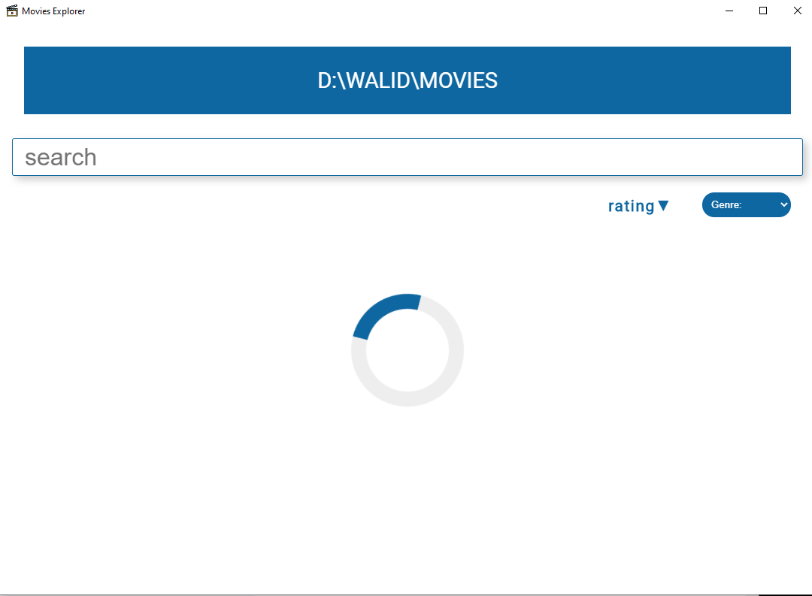
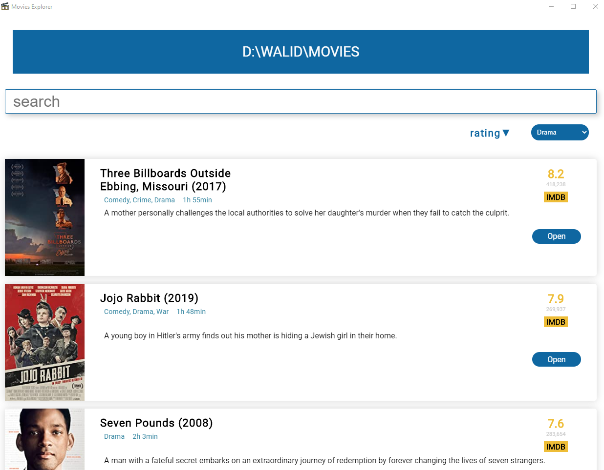

# Movies Explorer

## Description
An app that gets information about the movies located at any folder on your computer. It scrapes IMDB site using cheeriojs.

## Built using
- Nodejs
- Electronjs
- Cheeriojs

## Features
- Search movies
- Sort by IMDB rating
- Filter by genre
- Open imdb link 
- Open movie folder

## How to use 
 1. Open a new terminal
 2. Run `npm install`
 3. Run `npm run start` 
 4. Select movies folder

## Screenshots
 ### Home
 

### Loading
 

### Display Movies
 

